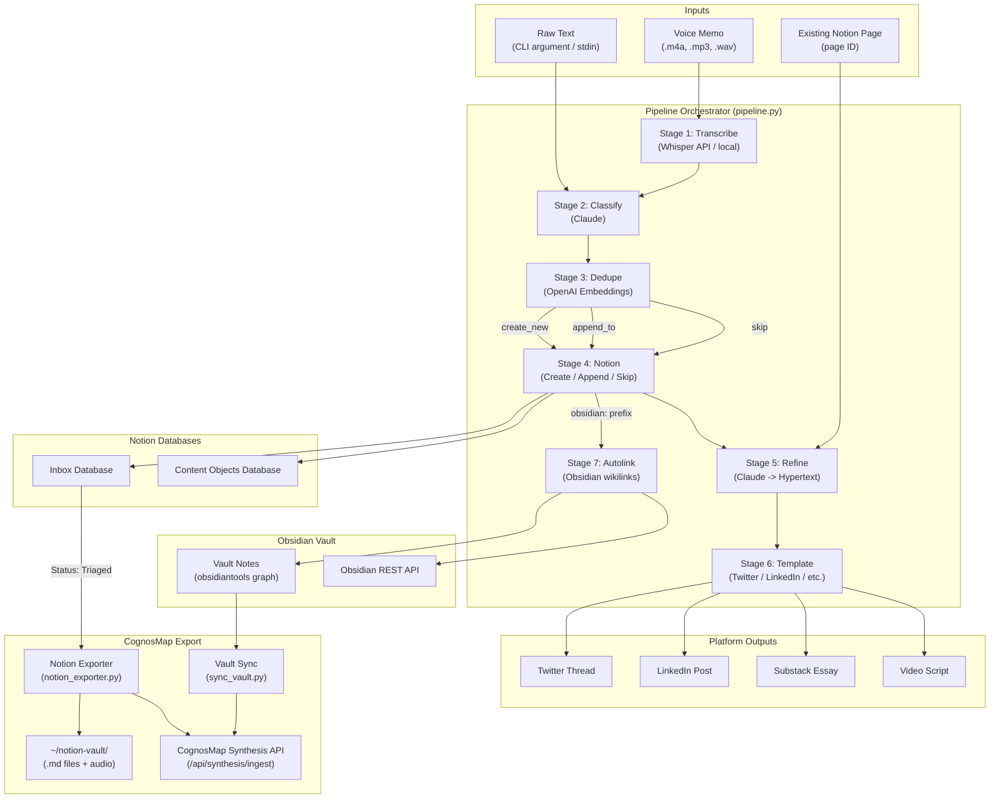
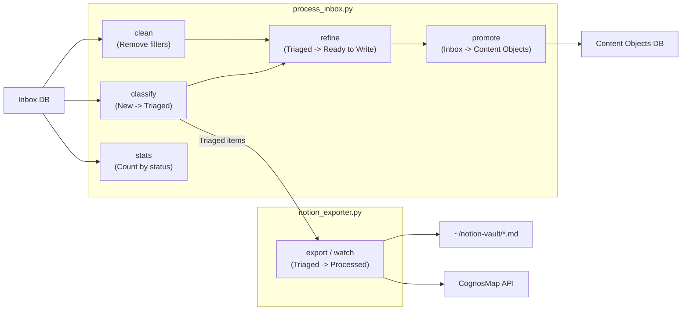
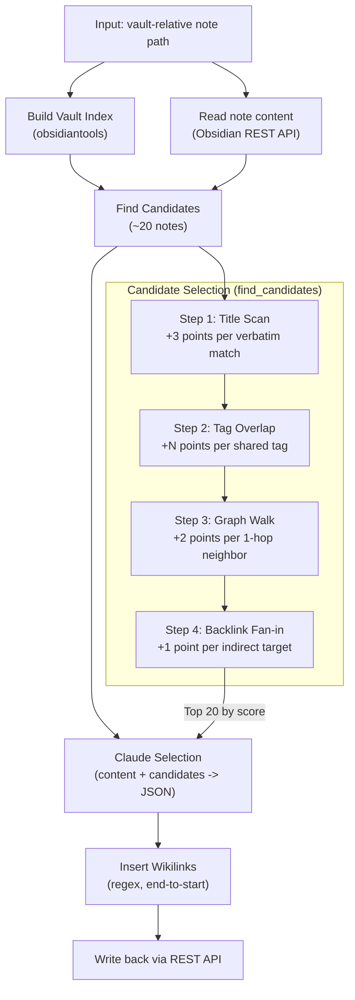

# CognosMap Automation Pipeline

A Python automation system that transforms voice memos and raw ideas into structured, searchable content in Notion, then syncs to CognosMap's knowledge graph. The pipeline handles transcription, classification, deduplication, refinement, multi-platform output generation, auto-wikilinking for Obsidian vaults, and export to CognosMap for truth-finding and interconnection discovery.

---

## Table of Contents

1. [Project Overview](#project-overview)
2. [Architecture Diagram](#architecture-diagram)
3. [Directory Structure](#directory-structure)
4. [Setup](#setup)
5. [Usage](#usage)
6. [Pipeline Stages](#pipeline-stages)
7. [Notion Exporter](#notion-exporter)
8. [Vault Sync](#vault-sync)
9. [Autolink System](#autolink-system)
10. [Vault Merge](#vault-merge)
11. [Testing](#testing)
12. [Configuration Reference](#configuration-reference)

---

## Project Overview

CognosMap Automation converts raw voice dumps and text ideas into structured knowledge objects through a multi-stage pipeline:

**Voice memo (or raw text) -> Transcribe -> Classify -> Deduplicate -> Notion -> Refine -> Template -> Autolink**

Each stage is independently usable, but the orchestrator (`pipeline.py`) chains them into a single command. The system targets a personal knowledge management workflow where ideas arrive as stream-of-consciousness voice memos and need to be triaged, deduplicated against existing content, stored in Notion databases, and optionally refined into publishable formats for Twitter, LinkedIn, Substack, or video.

The autolink subsystem separately handles Obsidian vault enrichment -- given a newly written note, it scans the vault graph, selects candidate link targets, and uses Claude to decide which `[[wikilinks]]` to insert.

The **Notion Exporter** watches Notion databases for triaged items and exports them as persistent `.md` files to `~/notion-vault/`, then syncs to CognosMap's synthesis API for graph ingestion and cross-source connection discovery. The **Vault Sync** script pushes Obsidian notes to the same API endpoint.

### External Dependencies

| Service | Purpose | Required |
|---------|---------|----------|
| Anthropic Claude | Classification, refinement, transcript cleaning, autolink decisions | Yes |
| OpenAI | Whisper transcription (API mode), embedding generation for dedup | Yes |
| Notion API | Database reads/writes (Inbox + Content Objects) | Yes |
| CognosMap API | Synthesis API for graph ingestion (VaultNote nodes + embeddings) | Only for exporter/sync |
| Obsidian Local REST API | Read/write notes for autolink | Only for autolink |
| Google Gemini | Referenced in settings (cheaper bulk tasks) | Optional |

---

## Architecture Diagram



### Batch Processing Flow



---

## Directory Structure

```
cognosmap-automation/
|
|-- src/                          # Core pipeline modules
|   |-- __init__.py               # Package exports (Pipeline, Classifier, etc.)
|   |-- pipeline.py               # Orchestrator -- chains all stages together
|   |-- transcribe.py             # Whisper API/local transcription
|   |-- classify.py               # Claude-based content classification
|   |-- dedupe.py                 # Embedding-based duplicate detection
|   |-- notion_client.py          # Notion API client (Inbox + Content Objects CRUD)
|   |-- refine.py                 # Raw text -> structured hypertext fragments
|   |-- templates.py              # Platform formatters (Twitter, LinkedIn, Substack, Video)
|   |-- clean.py                  # Transcript filler-word removal via Claude
|   |-- autolink.py               # Obsidian wikilink insertion via graph traversal + Claude
|
|-- config/                       # Configuration
|   |-- __init__.py               # Exports settings + NotionSchema
|   |-- settings.py               # Central settings loaded from .env
|   |-- notion_schema.py          # InboxItem / ContentObject dataclasses + Notion property mapping
|
|-- scripts/                      # Runnable entry points
|   |-- cli.py                    # Main CLI (process, refine, inbox, content, check, autolink)
|   |-- process_inbox.py          # Batch inbox operations (classify, clean, refine, promote, stats)
|   |-- notion_exporter.py        # Notion -> .md export + CognosMap sync (export, watch, status)
|   |-- sync_vault.py             # Obsidian vault -> CognosMap synthesis API sync
|   |-- watch_folder.py           # Filesystem watcher for auto-processing voice memos
|   |-- merge_vaults.py           # Merge Providence Obsidian vault into RealIcloudVault
|
|-- tests/                        # Pytest test suite
|   |-- __init__.py
|   |-- test_autolink.py          # Autolink candidate selection, insertion, Claude mock tests
|   |-- test_classify.py          # Classification result structure + mock Claude tests
|   |-- test_dedupe.py            # Cosine similarity, threshold logic tests
|   |-- test_pipeline.py          # Pipeline orchestration + stage ordering tests
|
|-- cron/
|   |-- crontab.txt               # Example cron schedule for automated processing
|
|-- specs/                        # Design specs and issue docs
|   |-- autolink-issue.md
|   |-- ISSUE-autolink.md
|   |-- multimedia-triage-pipeline-spec.md
|
|-- logs/                         # Runtime log output (gitignored)
|-- .env                          # API keys and configuration (gitignored)
|-- .env.example                  # Template for .env with placeholder values
|-- .gitignore
|-- requirements.txt              # Python dependencies
|-- setup.sh                      # One-command setup script
|-- IMPLEMENTATION_PLAN.md        # Original implementation plan
```

---

## Setup

### Prerequisites

- **Python 3.11+** (uses `str | Path` union syntax, `list[str]` generics)
- **Notion account** with an API integration created at https://www.notion.so/my-integrations
- **API keys** for: Anthropic (Claude), OpenAI
- **Obsidian** with Local REST API plugin (only for autolink feature)

### Quick Setup

```bash
cd ~/Documents/cognosmap-automation
chmod +x setup.sh
./setup.sh
```

This creates a venv, installs dependencies, and copies `.env.example` to `.env` if it does not already exist.

### Manual Setup

```bash
# Create virtual environment
python3 -m venv venv
source venv/bin/activate

# Install dependencies
pip install -r requirements.txt

# Configure environment
cp .env.example .env
# Edit .env with your actual API keys
```

### Verify Installation

```bash
source venv/bin/activate
python scripts/cli.py check
```

This tests connectivity to Notion, Anthropic, and OpenAI. Expected output shows green checkmarks for each service.

### Notion Database Setup

1. Create an integration at https://www.notion.so/my-integrations
2. Copy the "Internal Integration Token" to `NOTION_API_KEY` in `.env`
3. Share both databases (Inbox and Content Objects) with the integration via each database's "Connections" menu
4. Update the four database/data-source IDs in `config/settings.py` to match your workspace:
   - `inbox_database_id` -- from the Inbox database URL (for page creation)
   - `content_objects_database_id` -- from the Content Objects database URL (for page creation)
   - `inbox_data_source_id` -- for queries via `data_sources.query` (2025 Notion API format)
   - `content_data_source_id` -- same, for Content Objects

The 2025 Notion API split means querying uses `data_source_id` while page creation uses `database_id`. Both are required.

---

## Usage

All commands assume you have activated the virtual environment:

```bash
cd ~/Documents/cognosmap-automation
source venv/bin/activate
```

### CLI Commands (`scripts/cli.py`)

#### `process` -- Run the full pipeline

```bash
# Process inline text
python scripts/cli.py process "The biggest bottleneck in knowledge work is synthesis, not search"

# Process a voice memo
python scripts/cli.py process --voice ~/voice-memos/idea-2026-03-18.m4a

# Process with auto-refinement
python scripts/cli.py process "Your idea" --refine

# Process with refinement + platform outputs
python scripts/cli.py process "Your idea" -r -p twitter -p linkedin -p substack -p video

# Read from stdin (type content, Ctrl+D to finish)
python scripts/cli.py process
```

#### `refine` -- Refine an existing Notion page

```bash
# Refine a page and generate platform outputs
python scripts/cli.py refine "page-id-here" --platforms twitter --platforms linkedin
```

#### `inbox` -- List Inbox items

```bash
python scripts/cli.py inbox --status New --limit 20
python scripts/cli.py inbox --status Triaged
```

#### `content` -- List Content Objects

```bash
python scripts/cli.py content --limit 10
```

#### `check` -- Validate configuration and API connections

```bash
python scripts/cli.py check
```

#### `autolink` -- Insert wikilinks into an Obsidian note

```bash
# Dry run -- show suggestions without modifying the note
python scripts/cli.py autolink "01_Capture/My New Note.md" --dry-run

# Apply wikilinks
python scripts/cli.py autolink "01_Capture/My New Note.md"
```

The `note_path` argument is vault-relative (e.g., `01_Capture/My Note.md`), not an absolute filesystem path.

### Batch Processing (`scripts/process_inbox.py`)

These commands operate on existing Notion Inbox items in bulk.

```bash
# Classify unprocessed items (adds title, type, tags; moves New -> Triaged)
python scripts/process_inbox.py classify --status New --limit 20
python scripts/process_inbox.py classify --status New --limit 10 --dry-run

# Clean voice transcripts (removes filler words, formats paragraphs)
python scripts/process_inbox.py clean --tag voice-transcript --limit 10
python scripts/process_inbox.py clean --tag voice-transcript --dry-run

# Refine triaged items (generates structured hypertext)
python scripts/process_inbox.py refine --status Triaged --limit 5 --output ./refined/

# Promote inbox items to Content Objects database
python scripts/process_inbox.py promote --from-status "Ready to Write" --limit 5
python scripts/process_inbox.py promote --dry-run

# Show inbox statistics by status
python scripts/process_inbox.py stats
```

### Notion Exporter (`scripts/notion_exporter.py`)

Watches Notion databases for triaged items, exports them as `.md` files with YAML frontmatter, downloads audio attachments, and syncs to CognosMap's synthesis API.

```bash
# One-shot export of all Triaged items
python scripts/notion_exporter.py export

# Preview what would be exported (no files written, no API calls)
python scripts/notion_exporter.py export --dry-run --limit 5

# Export from a specific source only
python scripts/notion_exporter.py export --source inbox

# Long-running watch mode (polls every 60s by default)
python scripts/notion_exporter.py watch

# Watch with custom interval
python scripts/notion_exporter.py watch --interval 30

# Show export state (what has been exported, sync status)
python scripts/notion_exporter.py status
```

**Pipeline position:** Runs after `process_inbox.py classify` has moved items from New to Triaged. The exporter picks up Triaged items, exports them, then marks them as Processed in Notion.

```
[capture] -> [classify: New->Triaged] -> [notion_exporter: Triaged->Processed] -> CognosMap
```

**Output:**
- `.md` files in `~/notion-vault/inbox/` with YAML frontmatter (schema_version, notion_id, tags, etc.)
- Audio files (`.mp3`, `.m4a`, etc.) downloaded alongside the `.md` files
- State tracked in `~/notion-vault/.export-state.json` (content hash for idempotent re-runs)
- VaultNote nodes in CognosMap's Neo4j graph with embeddings in Pinecone

### Vault Sync (`scripts/sync_vault.py`)

Syncs Obsidian vault notes to CognosMap's synthesis API for graph ingestion and cross-source connection discovery.

```bash
# Full sync (all notes in vault)
python scripts/sync_vault.py

# Preview without syncing
python scripts/sync_vault.py --dry-run

# Sync first 10 notes only
python scripts/sync_vault.py --limit 10

# Custom vault path and API endpoint
python scripts/sync_vault.py --vault /path/to/vault --api http://localhost:8000
```

Each note becomes a VaultNote node in Neo4j with wikilinks preserved as `LINKS_TO` relationships and content embedded in Pinecone for semantic search.

### Folder Watcher (`scripts/watch_folder.py`)

Monitors a directory for new audio files and processes them automatically.

```bash
# Watch the default folder (VOICE_MEMO_FOLDER from .env)
python scripts/watch_folder.py

# Watch a specific folder
python scripts/watch_folder.py /path/to/voice-memos/

# Process existing files once and exit (no daemon)
python scripts/watch_folder.py --once

# Move processed files to a separate directory
python scripts/watch_folder.py --processed ~/voice-memos/done/
```

### Cron Automation

Example schedules are provided in `cron/crontab.txt`. All entries are commented out by default.

```bash
# Install the cron schedule (after reviewing and uncommenting desired jobs)
crontab cron/crontab.txt
```

Key schedules:
- Voice memo processing: every 15 minutes
- Inbox classification: every hour
- Content refinement: every 2 hours
- Daily stats report: 9 AM
- Inbox promotion: 10 AM
- Log rotation: weekly

---

## Pipeline Stages

### Stage 1: Transcribe (`src/transcribe.py`)

Converts audio files to text using OpenAI Whisper.

**Modes:**
- `api` (default) -- Sends audio to OpenAI's hosted Whisper API. Requires `OPENAI_API_KEY`.
- `local` -- Loads a local Whisper model. Requires `openai-whisper` + `torch` packages (large download). The model is lazy-loaded on first use.

**Supported formats:** `.m4a`, `.mp3`, `.mp4`, `.wav`, `.webm`, `.mpeg`, `.mpga`, `.ogg`

**Output:** Dict with `text` (full transcript), `segments` (timestamped chunks), `duration`, and `language`.

This stage is skipped entirely when the input is raw text.

### Stage 2: Classify (`src/classify.py`)

Uses Claude to analyze the text and extract structured metadata. The system prompt is tuned for a creator focused on AI/technology, philosophy, leadership, and personal development.

**Output fields:**

| Field | Type | Description |
|-------|------|-------------|
| `title` | `str` | Compelling, descriptive title |
| `content_type` | `str` | One of: Essay, Video, Post, Proself |
| `priority` | `str` | Active (urgent), Essential (soon), Backlog (later) |
| `category` | `str` | Best-fit from predefined list (AI/Technology, Philosophy/Spirituality, etc.) |
| `tags` | `list[str]` | 2-5 extracted topic tags |
| `main_idea` | `str` | 1-2 sentence summary |
| `atomic_ideas` | `list[str]` | Standalone insights that could each be their own post |
| `suggested_platforms` | `list[str]` | Recommended distribution channels |
| `related_concepts` | `list[str]` | Concepts to cross-reference |

If Claude returns malformed JSON, the classifier falls back to a default result using truncated input text.

### Stage 3: Dedupe (`src/dedupe.py`)

Checks whether the new content already exists in Notion using embedding-based similarity.

**Process:**
1. Generate an embedding for the new text using OpenAI `text-embedding-3-small` (truncated to 8000 chars)
2. Fetch the 50 most recent items from both Inbox and Content Objects databases
3. Compute cosine similarity between the new embedding and each existing item's embedding
4. Embeddings are cached in-memory by page ID to avoid redundant API calls

**Decision thresholds (default `DEDUPE_THRESHOLD=0.85`):**

| Similarity Score | Recommendation | Pipeline Action |
|-----------------|----------------|-----------------|
| >= 0.95 | `skip` | Do nothing -- nearly identical content exists |
| >= 0.85 | `append_to` | Append new text to the existing page |
| >= 0.68 (threshold * 0.8) | `review` | Flag for human review |
| < 0.68 | `create_new` | Create a new Inbox page |

### Stage 4: Notion (`src/notion_client.py`)

Acts on the deduplication recommendation:

- **`create_new`**: Creates a new page in the Inbox database with the classification metadata as properties and the raw transcript in the page body.
- **`append_to`**: Appends the new text to the existing page with a dated heading.
- **`skip`**: Records the existing page ID but makes no changes.

The client handles both the 2025 `data_sources.query` API (for reads) and the legacy `pages.create` API (for writes).

### Stage 5: Refine (`src/refine.py`) -- Optional

Transforms raw text into structured "hypertext" -- a set of typed fragments that can be reassembled for any platform. The guiding philosophy:

> "Digital aphorisms linked to longer meditations. A constellation, not a monolith."

**Output structure:**

```
RefinedContent
  |-- title: str
  |-- core_aphorism: str              # The single tweetable insight (<280 chars)
  |-- fragments: list[HypertextFragment]
  |     |-- fragment_type: str        # core_claim | supporting | example | source | counter
  |     |-- content: str              # 1-3 sentences
  |     |-- linked_concepts: list[str]
  |     |-- source_reference: str?
  |-- suggested_connections: list[str] # Related ideas to explore
  |-- structure_notes: str             # How pieces fit together
```

Also provides a `to_markdown()` method for rendering as a structured Markdown document with Obsidian-style `[[wikilinks]]` in the Related Ideas section.

### Stage 6: Template (`src/templates.py`) -- Optional

Formats refined content for specific platforms:

| Platform | Format | Key Details |
|----------|--------|-------------|
| `twitter_thread` | Numbered thread with hook | Auto-splits long tweets, adds thread emoji, CTA |
| `linkedin` | Hook + body + hashtags | Arrow-prefixed supporting points, auto-generated hashtags |
| `substack` | Full Markdown essay | Sections: Insight, Going Deeper, Examples, The Other Side, Takeaway |
| `video_script` | Timestamped segments | HOOK (0:00-0:15), PROBLEM, POINT 1-3, EXAMPLE, CTA with B-roll notes |

### Stage 7: Autolink (`src/autolink.py`) -- Optional

Triggers when `source_context` starts with `"obsidian:"`. See [Autolink System](#autolink-system) below for full details.

### Transcript Cleaning (`src/clean.py`)

A standalone module (not part of the main pipeline) for cleaning voice transcripts. Uses Claude to remove filler words (um, uh, like, you know, etc.) and format wall-of-text transcripts into logical paragraphs while strictly preserving the speaker's original wording and meaning.

Accessible via: `python scripts/process_inbox.py clean --tag voice-transcript`

---

## Notion Exporter

The Notion Exporter (`scripts/notion_exporter.py`) bridges Notion databases to CognosMap's knowledge graph by exporting pages as persistent `.md` files and syncing them to the synthesis API.

### Architecture

```
Notion Inbox (Status: Triaged)
         |
   [notion_exporter.py]
         |
         +---> ~/notion-vault/inbox/*.md     (persistent .md archive)
         +---> ~/notion-vault/inbox/*.mp3    (audio attachments)
         +---> CognosMap /api/synthesis/ingest  (graph + embeddings)
         +---> Notion status update (Triaged -> Processed)
```

### How It Works

1. **Poll**: Queries Notion for pages where Status = trigger status (e.g., "Triaged")
2. **Hash check**: Computes content hash; skips pages unchanged since last export
3. **Extract**: Pulls properties (title, tags, type, dates, URLs) + body content + audio blocks
4. **Export**: Writes `.md` file with YAML frontmatter to `~/notion-vault/{source}/`
5. **Download audio**: Finds file/audio blocks, downloads via temporary signed URLs
6. **Sync**: POSTs to CognosMap `/api/synthesis/ingest` with `note_id: "notion:{id}"`
7. **Update**: Sets Notion status to post_export_status (e.g., "Processed")
8. **State**: Records `{notion_id: {content_hash, filename, exported_at}}` in `.export-state.json`

### Exported File Format

```yaml
---
schema_version: 1
source: notion
notion_id: 2c0eba0c-abd5-45d0-a760-6549cd0f3c84
notion_database: inbox
type: Audio
status: Triaged
tags:
  - knowledge management
  - cognitive load
date_added: "2026-03-18"
source_url: "https://youtube.com/watch?v=..."
has_audio: true
audio_file: 2c0eba0c.mp3
content_hash: a1b2c3d4e5f67890
exported_at: "2026-03-18T12:00:00Z"
---

# Voice Memo Title

Transcript content here...
```

Filenames follow the pattern `{slugified-title}--{notion-id-short}.md` for human readability with machine-stable IDs.

### Extensibility

The exporter is database-agnostic. To add a new Notion database, add an `ExportSource` entry in `config/settings.py`:

```python
ExportSource(
    name="content_objects",
    database_id="db6f21b8-...",
    data_source_id="15d28d70-...",
    output_dir="content-objects",
    trigger_status="Planning",
    post_export_status="To-Do",
    title_prop="Name",
    content_prop=None,  # use page body blocks
    tag_prop="Tags",
    status_prop="Status",
),
```

No code changes required -- the exporter iterates over all configured sources.

---

## Vault Sync

The vault sync script (`scripts/sync_vault.py`) reads an Obsidian vault via `obsidiantools` and POSTs each note to CognosMap's `/api/synthesis/ingest` endpoint.

### What It Creates in CognosMap

For each note:
- **VaultNote node** in Neo4j with title, content hash, tags, and embedding ID
- **Embedding** in Pinecone (`vault_notes` namespace) for semantic search
- **LINKS_TO relationships** from wikilinks (e.g., `[[Essentialism]]` creates an edge)

This enables CognosMap to find cross-source connections between Notion exports and Obsidian notes, since both are stored as VaultNote nodes with embeddings.

### Folder Exclusions

The following vault folders are skipped during sync: `.obsidian`, `.smart-env`, `.trash`, `05_Utils`, `06_Archive`

---

## Autolink System

The autolink module (`src/autolink.py`) inserts `[[wikilinks]]` into Obsidian notes by combining graph-based candidate selection with Claude-based final judgment.

### How It Works



### Candidate Selection Algorithm

The `find_candidates` method scores every note in the vault using four signals, then sends the top 20 to Claude:

1. **Title Scan (+3 points)** -- If a note title (3+ characters) appears verbatim in the new note's content (case-insensitive), it scores +3. This catches direct references like "essentialism" matching a note titled "Essentialism".

2. **Tag Overlap (+N points)** -- For each tag shared between the new note and another note, the other note scores +1. A note sharing 3 tags gets +3 points. This surfaces thematically related notes that may not be mentioned by name.

3. **Graph Walk (+2 points)** -- Using the vault's link graph (a NetworkX `MultiDiGraph`), the algorithm looks at notes the new note already links to, then walks one hop to their successors and predecessors. Each 1-hop neighbor scores +2. This finds "friends of friends" in the knowledge graph.

4. **Backlink Fan-in (+1 point)** -- For each candidate already scored, the algorithm looks at what that candidate links to. If multiple candidates point to the same target, that target gets a bonus (+1 per pointing candidate). This surfaces hub notes that many related concepts converge on.

### Claude Decision

The top 20 candidates are sent to Claude along with the note content. Claude returns a JSON array of suggestions, each with:
- `target_title` -- which existing note to link to
- `anchor_phrase` -- the exact phrase in the note content that should become the link
- `confidence` -- high, medium, or low
- `reason` -- brief justification (under 10 words)

Low-confidence suggestions are filtered out based on `AUTOLINK_MIN_CONFIDENCE` (default: "medium" allows high + medium).

### Wikilink Insertion

The `insert_wikilinks` method processes suggestions from end-to-start to avoid offset drift:

- If the anchor phrase matches the target title (case-insensitive): inserts `[[phrase]]`
- If they differ: inserts `[[Target Title|phrase]]` (Obsidian alias syntax)
- Skips phrases already wrapped in `[[...]]`
- Only links the first occurrence of each phrase

### Configuration

| Setting | Default | Description |
|---------|---------|-------------|
| `AUTOLINK_MAX_SUGGESTIONS` | 8 | Max wikilinks Claude can suggest |
| `AUTOLINK_MIN_CONFIDENCE` | medium | Minimum confidence to accept (high, medium, low) |
| `OBSIDIAN_LOCAL_REST_API_KEY` | -- | API key for Obsidian REST plugin |
| `OBSIDIAN_VAULT_PATH` | (hardcoded) | Filesystem path to the vault |
| `OBSIDIAN_REST_API_PORT` | 27124 | Port the REST plugin listens on |

Folders skipped during indexing: `.obsidian`, `.smart-env`, `.trash`, `05_Utils`, `06_Archive`

### Requirements

- Obsidian must be running with the [Local REST API](https://github.com/coddingtonbear/obsidian-local-rest-api) plugin enabled
- The `obsidiantools` Python package must be installed (for vault graph construction)
- The vault path must be accessible from the machine running the script

---

## Vault Merge

The `scripts/merge_vaults.py` script merges a secondary Obsidian vault ("Providence") into the primary vault ("RealIcloudVault") as a dedicated subfolder.

### When to Use

Use this when you have a separate Obsidian vault that should be consolidated into your main vault -- for example, a project-specific or topic-specific vault that has grown enough to justify integration.

### What It Does

1. **Maps folders** -- Each Providence folder maps to a subfolder under `04_Resources/07_Providence/`:
   - `00-inbox` -> `04_Resources/07_Providence/00-inbox`
   - `01-journal` -> `04_Resources/07_Providence/01-journal`
   - `02-providence` -> `04_Resources/07_Providence/02-providence`
   - `03-scripture` -> `04_Resources/07_Providence/03-scripture`
   - `05-concepts` -> `04_Resources/07_Providence/05-concepts`
   - `06-sources` -> `04_Resources/07_Providence/06-sources`
   - `07-projects` -> `04_Resources/07_Providence/07-projects`

2. **Injects frontmatter** -- Adds `created` and `updated` timestamps (from file mtime) and a `source_vault/providence` tag for traceability.

3. **Rewrites Dataview queries** -- Dashboard notes have their `FROM` paths updated to the new locations so Dataview queries continue to work.

4. **Copies templates** -- Providence templates go to `05_Utils/Templates/Providence/`.

5. **Copies attachments** -- Providence attachments go to `05_Utils/Attachments/Providence/`.

6. **Skips conflicts** -- Files that already exist at the target path are skipped (logged in the manifest).

7. **Generates a manifest** -- A JSON manifest is saved at `04_Resources/07_Providence/merge_manifest.json` with all operations, skips, and errors.

### Usage

```bash
# Preview what would happen (no files touched)
python scripts/merge_vaults.py --dry-run

# Execute the merge
python scripts/merge_vaults.py

# Custom source/target paths
python scripts/merge_vaults.py --source /path/to/source --target /path/to/target
```

Default paths are hardcoded to the developer's iCloud Obsidian vault locations. Override with `--source` and `--target` flags.

---

## Testing

### Running Tests

```bash
# Activate the environment
source venv/bin/activate

# Run all tests
pytest

# Run with verbose output
pytest -v

# Run a specific test file
pytest tests/test_autolink.py
pytest tests/test_classify.py
pytest tests/test_dedupe.py
pytest tests/test_pipeline.py

# Run a specific test class or method
pytest tests/test_autolink.py::TestFindCandidates
pytest tests/test_autolink.py::TestInsertWikilinks::test_basic_insertion
```

### Test Coverage

| Test File | What It Covers |
|-----------|----------------|
| `test_autolink.py` | Candidate selection (title match, graph walk, tag overlap, self-skip, tiny title skip), wikilink insertion (basic, already-linked, case-insensitive, no double wrap, alias syntax), Claude response mocking, dry-run behavior, vault index folder exclusion |
| `test_classify.py` | ClassificationResult field structure, mock Claude classification, valid content types/priorities/categories from settings |
| `test_dedupe.py` | SimilarityMatch/DedupeResult field structure, cosine similarity math (identical/orthogonal/opposite vectors), no-match dedup scenario, default threshold validation |
| `test_pipeline.py` | PipelineResult default values, Pipeline component initialization, full text-processing flow with mocked components, stage ordering |

All tests use `unittest.mock` to avoid hitting real APIs. The autolink tests build a small NetworkX graph fixture to test graph traversal logic.

### What Is Not Tested

- `notion_client.py` (requires live Notion API)
- `refine.py` and `templates.py` (no test files exist)
- `clean.py` (no test file)
- `watch_folder.py`, `process_inbox.py`, `notion_exporter.py`, `sync_vault.py` (scripts, not unit-tested)
- `merge_vaults.py` (filesystem operations, no test file)
- End-to-end pipeline with real API calls

---

## Configuration Reference

### Environment Variables

All variables are loaded from `.env` via `python-dotenv`. See `.env.example` for a template.

#### Required

| Variable | Description |
|----------|-------------|
| `NOTION_API_KEY` | Notion internal integration token (starts with `ntn_`) |
| `ANTHROPIC_API_KEY` | Anthropic API key for Claude (starts with `sk-ant-`) |
| `OPENAI_API_KEY` | OpenAI API key for Whisper + embeddings (starts with `sk-`) |

#### Whisper (Transcription)

| Variable | Default | Description |
|----------|---------|-------------|
| `WHISPER_MODE` | `api` | `api` uses OpenAI hosted Whisper; `local` loads a model on-device |
| `WHISPER_MODEL` | `whisper-1` | For API mode: `whisper-1`. For local mode: `tiny`, `base`, `small`, `medium`, `large` |

#### Deduplication

| Variable | Default | Description |
|----------|---------|-------------|
| `DEDUPE_THRESHOLD` | `0.85` | Cosine similarity threshold (0.0-1.0). Higher = stricter matching, fewer duplicates caught |

#### Folder Watcher

| Variable | Default | Description |
|----------|---------|-------------|
| `VOICE_MEMO_FOLDER` | `~/voice-memos` | Directory monitored by `watch_folder.py` |

#### Obsidian / Autolink

| Variable | Default | Description |
|----------|---------|-------------|
| `OBSIDIAN_LOCAL_REST_API_KEY` | (none) | API key from the Obsidian Local REST API plugin settings |
| `OBSIDIAN_VAULT_PATH` | (hardcoded) | Absolute path to the Obsidian vault root |
| `OBSIDIAN_REST_API_PORT` | `27124` | Port the REST API plugin listens on |
| `AUTOLINK_MIN_CONFIDENCE` | `medium` | Minimum confidence for accepting a wikilink suggestion (`high`, `medium`, `low`) |
| `AUTOLINK_MAX_SUGGESTIONS` | `8` | Maximum number of wikilinks Claude can suggest per note |

#### Notion Exporter

| Variable | Default | Description |
|----------|---------|-------------|
| `NOTION_VAULT_PATH` | `~/notion-vault` | Directory where exported `.md` files and audio are stored |
| `COGNOSMAP_API_BASE` | `http://localhost:8000` | CognosMap API base URL for synthesis endpoints |
| `EXPORT_POLL_INTERVAL` | `60` | Seconds between polls in watch mode |

#### Gemini (Optional)

| Variable | Default | Description |
|----------|---------|-------------|
| `GEMINI_API_KEY` | (none) | Google Gemini API key (referenced in settings, for cheaper bulk tasks) |
| `GEMINI_MODEL` | `gemini-2.5-flash` | Gemini model identifier |

#### Other

| Variable | Default | Description |
|----------|---------|-------------|
| `VOYAGE_API_KEY` | (none) | Voyage AI API key for alternative embeddings (not currently used in pipeline) |
| `LOG_LEVEL` | `INFO` | Python logging level (`DEBUG`, `INFO`, `WARNING`, `ERROR`) |

### Hardcoded Settings (`config/settings.py`)

These values are set directly in the `Settings` class and not configurable via `.env`:

| Setting | Value | Description |
|---------|-------|-------------|
| `claude_model` | `claude-sonnet-4-20250514` | Claude model used for classify, refine, clean, autolink |
| `embedding_model` | `text-embedding-3-small` | OpenAI embedding model for dedup |
| `embedding_dimensions` | `1536` | Embedding vector size |
| `inbox_database_id` | (UUID) | Notion database ID for Inbox (page creation) |
| `content_objects_database_id` | (UUID) | Notion database ID for Content Objects (page creation) |
| `inbox_data_source_id` | (UUID) | Notion data source ID for Inbox (querying) |
| `content_data_source_id` | (UUID) | Notion data source ID for Content Objects (querying) |
| `content_types` | Essay, Video, Post, Proself | Valid content type classifications |
| `priority_levels` | Active, Essential, Backlog | Valid priority levels |
| `categories` | 8 categories | Valid content categories |
| `clean_trigger_tag` | `voice-transcript` | Tag that triggers transcript cleaning |
| `autolink_skip_folders` | `.obsidian`, `.smart-env`, `.trash`, `05_Utils`, `06_Archive` | Folders excluded from vault indexing |
| `export_sources` | `[ExportSource(name="inbox", ...)]` | List of Notion databases to export (see [Extensibility](#extensibility)) |

### Notion Database Schema

#### Inbox Database

| Property | Notion Type | Python Field | Notes |
|----------|-------------|--------------|-------|
| Title | Title | `title` | Required |
| Date Added | Date | `date_added` | Auto-populated |
| Status | Select | `status` | New, Triaged, Processed, Ready to Write |
| Tags | Multi-select | `tags` | Auto-extracted by classifier |
| Type | Select | `type` | Essay, Video, Post, Proself |
| Project | Select | `project` | Optional |
| URL | URL | `url` | Optional source URL |

#### Content Objects Database

| Property | Notion Type | Python Field | Notes |
|----------|-------------|--------------|-------|
| Name | Title | `name` | Required |
| Category | Select | `category` | From predefined list |
| Content Type | Select | `content_type` | Essay, Video, Post, Proself |
| Status | Select | `status` | Backlog, To-Do, Planning, Draft, Published |
| Date Created | Date | `date_created` | Auto-populated |
| Tags | Multi-select | `tags` | Topic tags |
| Main Idea | Rich Text | `main_idea` | Core insight (truncated to 2000 chars for Notion) |
| Original Transcript | Rich Text | `original_transcript` | Raw source text (truncated to 2000 chars) |
| Platform | Multi-select | `platform` | Target distribution platforms |
| Target Publish Date | Date | `target_publish_date` | Optional deadline |
| Atomic Ideas | Relation | `atomic_ideas` | Relation IDs to atomic idea pages |
| Asset Folder URL | URL | `asset_folder_url` | Optional |
| Transcript URL | URL | `transcript_url` | Optional |
| Post Examples | URL | `post_examples` | Optional |

---

## License

Private -- Nicholas Grijalva
