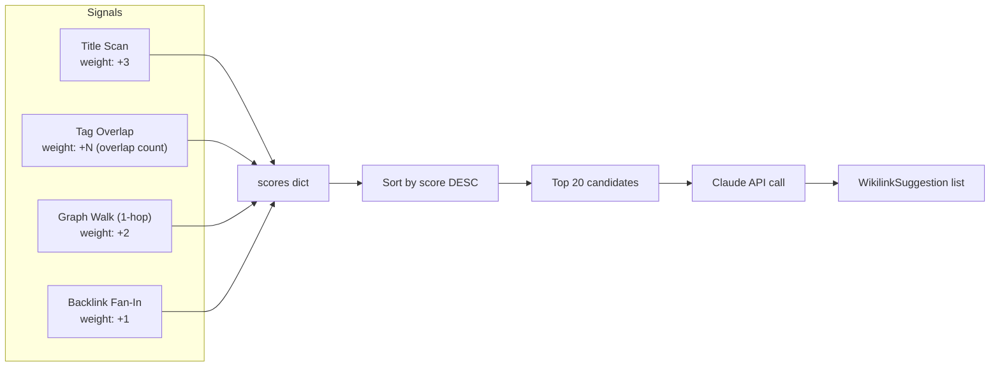

# Code Review: Autolink Module and Related Files

**Date:** 2026-03-18
**Reviewer:** Claude Opus 4.6 (automated analysis)
**Scope:** `src/autolink.py`, `tests/test_autolink.py`, `scripts/merge_vaults.py`, `scripts/cli.py`, `config/settings.py`, `src/pipeline.py`

---

## Executive Summary

The autolink module is a well-structured addition to the CognosMap pipeline that addresses a real gap: programmatic wikilink insertion into Obsidian notes via graph traversal and LLM-based suggestion. The core architecture -- candidate scoring via title scan, tag overlap, and graph walk, followed by Claude-based selection -- is sound.

However, there are **three critical bugs** that will cause failures in production:

1. **The CLI checks for `gemini_api_key` but the module uses `anthropic`** -- the guard clause will incorrectly block users who have Anthropic configured but not Gemini, and pass users through who have Gemini but not Anthropic.
2. **Vault-relative paths with spaces are not URL-encoded** in REST API calls, meaning any note like `01_Capture/My Great Note.md` will 404.
3. **The `insert_wikilinks` boundary check uses a 2-character window** (`content[start-2:start]`), which misses `[[` when the link brackets aren't immediately adjacent to the anchor text.

Beyond these, there are important issues around missing `networkx` in `requirements.txt`, no frontmatter protection in the wikilink inserter, uncapped graph traversal cost at scale, and several test coverage gaps.

The `merge_vaults.py` script is solid for a one-shot migration tool. `settings.py` changes are clean. The pipeline integration is minimal and correctly non-fatal. Overall code quality is good -- the main work is fixing the three bugs and hardening edge cases.

---

## Table of Contents

1. [Critical Issues (Must Fix)](#1-critical-issues-must-fix)
2. [Important Issues (Should Fix)](#2-important-issues-should-fix)
3. [Minor Issues (Nice to Fix)](#3-minor-issues-nice-to-fix)
4. [What's Done Well](#4-whats-done-well)
5. [Test Coverage Analysis](#5-test-coverage-analysis)
6. [Architecture Diagram](#6-architecture-diagram)
7. [File-by-File Summary](#7-file-by-file-summary)

---

## 1. Critical Issues (Must Fix)

### 1.1 CLI Checks for Gemini Key but Module Uses Anthropic

[scripts/cli.py](../scripts/cli.py) (Line 305-307):
```python
if not settings.gemini_api_key:
    console.print("[red]GEMINI_API_KEY not set in .env[/red]")
    sys.exit(1)
```

[src/autolink.py](../src/autolink.py) (Line 91):
```python
self.client = anthropic.Anthropic(api_key=settings.anthropic_api_key)
```

The CLI `autolink` command validates `gemini_api_key` before launching, but `AutoLinker.__init__` creates an `anthropic.Anthropic` client and uses `settings.anthropic_api_key`. The settings file has both Gemini and Anthropic configs, but the autolink module uses only Anthropic.

**Impact:** A user with a valid `ANTHROPIC_API_KEY` but no `GEMINI_API_KEY` is blocked at the CLI gate. Conversely, a user with only `GEMINI_API_KEY` passes the gate, then hits an authentication error from Anthropic at runtime.

**Fix:** Replace the Gemini check with an Anthropic key check:
```python
if not settings.anthropic_api_key:
    console.print("[red]ANTHROPIC_API_KEY not set in .env[/red]")
    sys.exit(1)
```

(Alternatively, if the intent from the spec comment on line 83 of `settings.py` -- "Gemini (used for autolink - cheaper than Claude for bulk tasks)" -- is to eventually switch to Gemini, then the module itself needs to be ported to use `google.generativeai` instead. But as written today, it uses Anthropic.)

---

### 1.2 Vault Paths with Spaces Are Not URL-Encoded

[src/autolink.py](../src/autolink.py) (Line 184-190):
```python
resp = httpx.get(
    f"{self.api_base}/vault/{vault_relative_path}",
    headers=headers,
    verify=False,
)
```

And again at line 307-312 (the PUT call). The `vault_relative_path` is interpolated directly into the URL. Obsidian vault paths routinely contain spaces (e.g., `01_Capture/Agent Frameworks Suck, and what to do about it.md`).

**Impact:** Any note whose path contains spaces, commas, or other URL-unsafe characters will fail with a 404 or malformed request. Given the user's vault structure shown in the spec, this will affect the majority of notes.

**Fix:** URL-encode the path component:
```python
from urllib.parse import quote

resp = httpx.get(
    f"{self.api_base}/vault/{quote(vault_relative_path, safe='/')}",
    headers=headers,
    verify=False,
)
```

The `safe='/'` preserves directory separators while encoding spaces and special characters. This needs to be applied in three places: `get_note_content`, `update_note`, and the health check in `autolink_note`.

---

### 1.3 Wikilink Boundary Check Has a 2-Character Window Bug

[src/autolink.py](../src/autolink.py) (Line 282-285):
```python
before = content[max(0, start - 2) : start]
after = content[end : end + 2]
if "[[" in before or "]]" in after:
    continue
```

This checks only 2 characters before/after the match. It works when `[[` is immediately adjacent (e.g., `[[essentialism]]`), but consider these cases:

- `[[ essentialism ]]` -- the `[[` is 3 characters before the "e", so `before` is `" e"` which does not contain `[[`. The link gets double-wrapped.
- Nested markdown like `> [[essentialism]]` in a blockquote also depends on exact adjacency.

The check is also asymmetric with the actual Obsidian syntax. In Obsidian, `[[Essentialism|essentialism]]` means the display text "essentialism" links to the "Essentialism" note. If content already has `[[Something|essentialism]]`, the 2-char before-window sees `"|e"` not `[[`.

**Impact:** Double-wrapping links (producing `[[[[Essentialism]]]]` or `[[Essentialism|[[Essentialism]]]]`) will break Obsidian's parser and corrupt note content.

**Fix:** Use a regex-based check that looks for enclosing `[[...]]` rather than a fixed-width character window:

```python
# Check if this match position is already inside a [[...]] link
preceding = content[:start]
following = content[end:]

# Count unmatched [[ before this position
open_brackets = preceding.count("[[") - preceding.count("]]")
if open_brackets > 0:
    continue  # Inside an existing link

# Check if ]] follows closely (within reason)
if "]]" in following[:50] and "[[" not in following[:following.index("]]")]:
    # There's a closing ]] without an opening [[ between -- we're inside a link
    # But this is the preceding check's job. Just check immediate adjacency more broadly.
    pass
```

A simpler and more robust approach: use a regex to find all `[[...]]` spans first, then skip any match whose position falls within one:

```python
import re

linked_spans = [(m.start(), m.end()) for m in re.finditer(r'\[\[.*?\]\]', content)]

def is_inside_link(pos_start, pos_end):
    return any(ls <= pos_start and pos_end <= le for ls, le in linked_spans)
```

---

## 2. Important Issues (Should Fix)

### 2.1 Missing `networkx` in `requirements.txt`

[requirements.txt](../requirements.txt) (Line 31-33):
```
# Obsidian autolink
obsidiantools>=0.11.0
python-frontmatter>=1.0.0
google-generativeai>=0.8.0
```

`obsidiantools` depends on `networkx` (and `pandas`), but these are transitive dependencies -- they get installed as sub-dependencies of `obsidiantools`. However, `tests/test_autolink.py` directly imports `networkx`:

```python
import networkx as nx
```

If a user pins or installs differently, or if `obsidiantools` ever drops `networkx` as a dep, the test breaks. More importantly, **`google-generativeai>=0.8.0` is listed as a dependency but is never imported anywhere in the codebase.** This is dead weight from the spec's original plan to use Gemini.

**Fix:**
- Add `networkx>=3.0` explicitly to requirements.txt (since the code uses it directly in tests).
- Remove `google-generativeai>=0.8.0` unless there are concrete plans to switch.

---

### 2.2 Wikilink Insertion Corrupts YAML Frontmatter

[src/autolink.py](../src/autolink.py) (Line 270-298):

The `insert_wikilinks` method operates on the entire note content, including YAML frontmatter. Obsidian notes typically start with:

```yaml
---
title: Notes on Essentialism
tags: [philosophy, essentialism]
---
```

If the anchor phrase "essentialism" appears in the frontmatter (inside a tag list, the title, or any metadata field), `re.finditer` will match it and `insert_wikilinks` will inject `[[Essentialism]]` into the YAML block. This will break the frontmatter parser.

**Impact:** Frontmatter corruption makes the note unparseable by Obsidian and other tools. Since the function writes back via the REST API, this is a destructive, hard-to-undo error.

**Fix:** Split content at the frontmatter boundary before processing:

```python
def insert_wikilinks(self, content: str, suggestions: list[WikilinkSuggestion]) -> str:
    # Protect YAML frontmatter
    body = content
    frontmatter = ""
    if content.startswith("---"):
        end_idx = content.find("---", 3)
        if end_idx != -1:
            frontmatter = content[:end_idx + 3]
            body = content[end_idx + 3:]

    # ... (process body only) ...

    return frontmatter + body
```

---

### 2.3 `build_vault_index` Rebuilds the Entire Graph on Every Call

[src/autolink.py](../src/autolink.py) (Line 94-119):

```python
def build_vault_index(self) -> VaultIndex:
    import obsidiantools.api as otools
    vault = otools.Vault(self.vault_path).connect().gather()
```

Every invocation of `autolink_note` calls `build_vault_index`, which scans the entire vault, builds a networkx graph, and gathers metadata. For a vault with 2500+ notes (as mentioned in the spec context), this is a significant I/O and CPU cost -- potentially 5-15 seconds per call.

If a batch of notes needs autolinking (e.g., after a vault merge), this rebuilds the index N times.

**Impact:** Unusable for batch operations. Even for single-note use, the cold start time degrades UX.

**Fix:** Cache the `VaultIndex` with a TTL or pass it as a parameter:

```python
def autolink_note(
    self, vault_relative_path: str, dry_run: bool = False, index: VaultIndex = None
) -> AutolinkResult:
    if index is None:
        index = self.build_vault_index()
    # ...
```

For a more robust approach, add a module-level cache with filesystem mtime checking:

```python
_vault_index_cache: Optional[tuple[float, VaultIndex]] = None

def build_vault_index(self, force: bool = False) -> VaultIndex:
    global _vault_index_cache
    vault_mtime = max(p.stat().st_mtime for p in self.vault_path.rglob("*.md"))
    if _vault_index_cache and not force:
        cached_mtime, cached_index = _vault_index_cache
        if cached_mtime >= vault_mtime:
            return cached_index
    # ... rebuild ...
```

---

### 2.4 Backlink Fan-In Step Has Unbounded Growth

[src/autolink.py](../src/autolink.py) (Line 165-171):

```python
# Step 4: Backlink fan-in -- notes pointed to by multiple candidates
for candidate in list(scores.keys()):
    if not g.has_node(candidate):
        continue
    for target in g.successors(candidate):
        if target != note_stem and target in title_set:
            scores[target] = scores.get(target, 0) + 1
```

This iterates over all current candidates and adds their successors to the score map. The problem: it iterates over `list(scores.keys())` which is a snapshot, but `scores[target]` can add new keys. Those new keys won't be iterated in this pass, but the loop itself can explode the candidate count.

With a vault of 2500 notes and a densely connected graph, if the initial title scan + tag overlap finds 100 candidates, each with an average of 10 successors, this step adds up to 1000 new entries to `scores`. The sort at line 173 then processes all of them.

**Impact:** Performance degradation at scale. Not a correctness bug, but with a large vault, `find_candidates` could take several seconds just in this step.

**Fix:** Either cap the iteration to the top-N candidates by score, or skip this step if the candidate count already exceeds `max_candidates`:

```python
if len(scores) < max_candidates:
    top_candidates = sorted(scores, key=scores.get, reverse=True)[:max_candidates]
    for candidate in top_candidates:
        # ... fan-in logic ...
```

---

### 2.5 `verify=False` Suppresses TLS Warnings and Has No Warning Filter

[src/autolink.py](../src/autolink.py) (Lines 187, 311, 322):

All three `httpx` calls use `verify=False`. This is expected -- the Obsidian Local REST API uses a self-signed certificate on localhost. However, `httpx` emits a warning on every call when verification is disabled. Over a batch run, this floods the logs.

**Fix:** Either suppress the specific warning:
```python
import warnings
import urllib3
warnings.filterwarnings("ignore", category=urllib3.exceptions.InsecureRequestWarning)
```

Or, better, create a shared `httpx.Client` with verification disabled once in `__init__`:
```python
self.http = httpx.Client(verify=False, timeout=10.0)
```

This also fixes the missing timeout on `get_note_content` and `update_note` (only the health check has `timeout=5`).

---

### 2.6 No Timeout on `get_note_content` and `update_note`

[src/autolink.py](../src/autolink.py) (Lines 184-190, 307-313):

The health check at line 322 has `timeout=5`, but `get_note_content` and `update_note` use the default `httpx` timeout (which is 5 seconds for connect but no read timeout by default in recent versions, or varies by version).

**Impact:** If Obsidian hangs or the REST API stalls, these calls block indefinitely.

**Fix:** Use a shared client as described in 2.5, or explicitly set `timeout=10.0` on each call.

---

### 2.7 `hardcoded Notion IDs` in `settings.py`

[config/settings.py](../config/settings.py) (Lines 27-31):

```python
self.inbox_data_source_id = "418b91e7-0c93-45b7-b905-c4715ab25964"
self.content_data_source_id = "15d28d70-ca5f-4183-b0fb-667af249ac20"
self.inbox_database_id = "2c0eba0c-abd5-45d0-a760-6549cd0f3c84"
self.content_objects_database_id = "db6f21b8-b261-4711-9ae0-b920861ec3c0"
```

These are hardcoded UUIDs tied to a specific Notion workspace. They are not API keys, but they are environment-specific. If someone forks this repo or the workspace changes, these break silently.

**Fix:** Move these to `.env` with the current values as defaults:
```python
self.inbox_database_id = os.getenv("INBOX_DATABASE_ID", "2c0eba0c-abd5-45d0-a760-6549cd0f3c84")
```

---

## 3. Minor Issues (Nice to Fix)

### 3.1 `merge_vaults.py` Hardcodes User-Specific Paths

[scripts/merge_vaults.py](../scripts/merge_vaults.py) (Lines 22-27):

```python
PROVIDENCE_PATH = Path(
    "/Users/nick/Library/Mobile Documents/iCloud~md~obsidian/Documents/Providence"
)
REALVAULT_PATH = Path(
    "/Users/nick/Library/Mobile Documents/iCloud~md~obsidian/Documents/RealIcloudVault"
)
```

These are reasonable as defaults for a personal tool, and the script accepts `--source` and `--target` overrides. Not a bug, but worth noting for portability.

---

### 3.2 `_make_linker()` Test Helper Bypasses `__init__`

[tests/test_autolink.py](../tests/test_autolink.py) (Lines 60-71):

```python
def _make_linker():
    """Create an AutoLinker without calling __init__."""
    linker = AutoLinker.__new__(AutoLinker)
    linker.vault_path = Path("/fake/vault")
    # ... manually set all attributes ...
```

Using `__new__` to skip `__init__` is a valid test pattern but it's fragile: if `__init__` adds a new attribute, the test helper won't set it, causing subtle `AttributeError` failures. A more robust approach is to mock `settings` and let `__init__` run normally.

---

### 3.3 `tags_index` Type Annotation Is Bare `dict`

[src/autolink.py](../src/autolink.py) (Line 42):

```python
tags_index: dict = field(default_factory=dict)  # {stem: [tags]}
```

The comment documents the actual type, but the annotation is just `dict`. For consistency with the rest of the dataclass:

```python
tags_index: dict[str, list[str]] = field(default_factory=dict)
```

---

### 3.4 `graph: object = None` Annotation

[src/autolink.py](../src/autolink.py) (Line 41):

```python
graph: object = None  # nx.MultiDiGraph
```

This should be `Optional[Any]` or a `TYPE_CHECKING` conditional import of `networkx.MultiDiGraph`. Using `object` means type checkers won't catch misuse of graph methods.

---

### 3.5 Pipeline Stage Comment Lists 7 Stages but Only 6 Are Documented

[src/pipeline.py](../src/pipeline.py) (Line 29):

```python
stage_reached: str  # transcribe, classify, dedupe, notion, refine, template, autolink
```

The docstring on the `Pipeline` class (lines 47-57) documents 6 stages. The 7th stage (autolink) is in the comment on `PipelineResult.stage_reached` but not in the class docstring. The `test_pipeline.py` test `test_stage_order` also only tests 6 stages.

---

### 3.6 `autolink_result` Typed as `object` in Pipeline

[src/pipeline.py](../src/pipeline.py) (Line 39):

```python
autolink_result: Optional[object] = None  # AutolinkResult (lazy import)
```

This loses all type information. A cleaner approach:

```python
from __future__ import annotations
from typing import TYPE_CHECKING

if TYPE_CHECKING:
    from .autolink import AutolinkResult
```

Then: `autolink_result: Optional[AutolinkResult] = None`

---

### 3.7 `Syntax` Import Unused in CLI

[scripts/cli.py](../scripts/cli.py) (Line 19):

```python
from rich.syntax import Syntax
```

This import is never used in the file. Remove it.

---

### 3.8 `.env` Contains a Real API Key Committed to Git History

[.env](../.env) (Line 32):

The `.env` file contains what appears to be a real Gemini API key, Obsidian REST API key, and vault path. While `.env` is in `.gitignore`, if it was ever committed, the keys are in git history. The `.env` shown during review contains:

```
GEMINI_API_KEY=<redacted>
OBSIDIAN_LOCAL_REST_API_KEY=<redacted>
```

**Note:** Real key values were visible during review. If these are production keys, consider rotating them. The `.gitignore` correctly excludes `.env`, but confirm these were never committed to git history (check with `git log --all -p -- .env`).

---

### 3.9 `merge_vaults.py` Does Not Handle Symlinks in Attachments

[scripts/merge_vaults.py](../scripts/merge_vaults.py) (Lines 178-198):

The attachment copy loop uses `shutil.copy2` which follows symlinks by default. If any attachment is a symlink, it copies the target file rather than the link. This is probably fine for an Obsidian vault, but worth noting.

Additionally, `attachment_dir.iterdir()` is not recursive -- it only catches files directly in `attachments/`, not subdirectories. If the source vault has nested attachment folders, they'll be silently skipped.

---

## 4. What's Done Well

### 4.1 Candidate Scoring System

The multi-signal scoring approach in `find_candidates` (title scan = +3, tag overlap = +N, graph walk = +2, fan-in = +1) is well-weighted. Title matches are correctly prioritized highest since they represent direct textual references. The weights create a sensible ranking without over-engineering.

### 4.2 Reverse-Order Insertion

Processing insertions from end to start (line 289: `insertions.sort(key=lambda x: x[0], reverse=True)`) correctly prevents position drift. This is a common source of bugs in string manipulation, and it's handled correctly here.

### 4.3 Flexible JSON Key Parsing

[src/autolink.py](../src/autolink.py) (Lines 250-256):

```python
title = (
    item.get("target_title")
    or item.get("target_note")
    or item.get("link_target")
    or item.get("title", "")
)
```

Accepting multiple possible key names from the Claude response is pragmatic. LLMs don't always use the exact field names requested, and this fallback chain handles common variations gracefully.

### 4.4 Dry Run Support

The `dry_run` flag is threaded through cleanly from CLI to `autolink_note`. It returns suggestions without writing, and the CLI displays the diff in a table. This is good UX for a tool that modifies files.

### 4.5 Non-Fatal Autolink in Pipeline

[src/pipeline.py](../src/pipeline.py) (Lines 241-255):

The autolink stage in the pipeline is wrapped in a try/except and logged as a warning, not an error. This correctly treats autolinking as an enhancement that shouldn't block the core pipeline.

### 4.6 Test Coverage Is Focused on the Right Things

The tests cover the core logic paths: candidate finding (title match, graph walk, tag overlap, self-skip, tiny-title skip), insertion mechanics (basic, already-linked, case-insensitive, no-double-wrap, aliased links), Claude response parsing (mock response, confidence filtering), and the dry-run flow. The mock setup is clean and the assertions are specific.

### 4.7 Merge Vault Script Is Well-Structured

`merge_vaults.py` follows a clear pattern: manifest-driven operations with dry-run support, skip-if-exists safety, and frontmatter injection for traceability. The Dataview path rewriting is a nice touch. The manifest JSON output provides an audit trail.

---

## 5. Test Coverage Analysis

### What's Covered (14 tests)

| Area | Tests | Notes |
|------|-------|-------|
| `find_candidates` | 5 | Title match, graph walk, tag overlap, self-skip, tiny title |
| `insert_wikilinks` | 5 | Basic, already-linked, case-insensitive, no-double-wrap, aliased |
| `suggest_wikilinks` | 2 | Mock Claude response, confidence filtering |
| `autolink_note` | 1 | Dry run flow |
| `build_vault_index` | 1 | Skip folders |

### What's Not Covered

1. **`update_note`** -- No test for the PUT call, error handling, or response validation.

2. **`get_note_content`** -- No test for the GET call, including error cases (404, auth failure, timeout).

3. **`autolink_note` live path (non-dry-run)** -- The test only covers `dry_run=True`. The path where content is actually modified and written back is untested.

4. **`autolink_note` API unreachable** -- The `ConnectError` early return (lines 321-329) is not tested.

5. **Claude returning malformed JSON** -- `suggest_wikilinks` has a `json.JSONDecodeError` handler (line 232), but no test exercises it.

6. **Claude returning empty array** -- What happens when Claude returns `[]`? The code handles it, but there's no test.

7. **Multiple insertions in same note** -- No test with 2+ suggestions that both match content.

8. **Frontmatter corruption** -- No test proving that YAML frontmatter is or isn't protected during insertion (per issue 2.2).

9. **URL-encoded paths** -- No test for note paths containing spaces or special characters.

10. **Pipeline autolink integration** -- `test_pipeline.py` has no test for the `source_context.startswith("obsidian:")` branch.

### Recommended Additional Tests

```python
def test_malformed_claude_response(self, sample_index):
    """suggest_wikilinks returns [] when Claude returns garbage."""

def test_empty_candidates_skips_claude(self, sample_index):
    """No API call when find_candidates returns empty list."""

def test_multiple_insertions(self):
    """Two suggestions both insert correctly without interfering."""

def test_frontmatter_not_modified(self):
    """YAML frontmatter is not touched by insert_wikilinks."""

def test_api_unreachable_returns_error(self):
    """autolink_note returns error when REST API is down."""

def test_live_write_path(self):
    """Non-dry-run path calls update_note with modified content."""
```

---

## 6. Architecture Diagram

```mermaid
flowchart TD
    subgraph CLI ["scripts/cli.py"]
        A["autolink command"]
    end

    subgraph AutoLinker ["src/autolink.py"]
        B["autolink_note()"]
        C["build_vault_index()"]
        D["get_note_content()"]
        E["find_candidates()"]
        F["suggest_wikilinks()"]
        G["insert_wikilinks()"]
        H["update_note()"]
    end

    subgraph External ["External Services"]
        I["Obsidian Local REST API<br/>(HTTPS, self-signed)"]
        J["Claude API<br/>(Anthropic)"]
        K["obsidiantools<br/>(vault scan + networkx graph)"]
    end

    subgraph Pipeline ["src/pipeline.py"]
        L["_process_text_internal()"]
        M["Stage 7: Autolink<br/>(if source_context starts with 'obsidian:')"]
    end

    A --> B
    L --> M --> B
    B --> C --> K
    B --> D --> I
    B --> E
    E -->|"title scan + tag overlap + graph walk"| F
    F -->|"candidates + content"| J
    F -->|"suggestions"| G
    G -->|"modified content"| H --> I

    style B fill:#2d5016,stroke:#4a8c1c
    style E fill:#1a3a5c,stroke:#2a6a9c
    style G fill:#5c1a1a,stroke:#9c2a2a

    classDef critical fill:#5c1a1a,stroke:#9c2a2a,color:#fff
    classDef important fill:#5c4a1a,stroke:#9c7a2a,color:#fff
```



### Data Flow for `find_candidates` Scoring



---

## 7. File-by-File Summary

### `src/autolink.py`
- **Critical:** URL encoding for paths with spaces (1.2), boundary check window too small (1.3)
- **Important:** Frontmatter corruption risk (2.2), vault index rebuilt every call (2.3), unbounded fan-in (2.4), missing timeouts (2.6)
- **Good:** Candidate scoring, reverse insertion, flexible JSON parsing, dry-run support

### `tests/test_autolink.py`
- **Good:** 14 tests covering core logic, clean mock setup
- **Gap:** No tests for error paths, API calls, non-dry-run write path, frontmatter safety, multiple simultaneous insertions

### `scripts/merge_vaults.py`
- **Minor:** Hardcoded user paths (acceptable for personal tool), non-recursive attachment copy
- **Good:** Manifest-driven, dry-run support, frontmatter injection, Dataview rewrite

### `scripts/cli.py`
- **Critical:** Gemini key check instead of Anthropic (1.1)
- **Minor:** Unused `Syntax` import (3.7)
- **Good:** Rich output formatting, follows existing CLI patterns, dry-run display

### `config/settings.py`
- **Important:** Hardcoded Notion UUIDs (2.7)
- **Minor:** `google-generativeai` in requirements but unused
- **Good:** Clean env var loading, sane defaults, config validation method

### `src/pipeline.py`
- **Minor:** Autolink stage not in class docstring (3.5), `autolink_result` typed as `object` (3.6)
- **Good:** Non-fatal autolink integration, correct stage ordering, clean `source_context` convention

---

## Comprehensive Summary

The autolink feature achieves its stated goal: closing the voice-to-graph loop by programmatically inserting wikilinks via graph traversal and LLM selection. The architecture is sound -- the multi-signal candidate scoring avoids brute-forcing all 2500+ titles through Claude, and the reverse-order insertion prevents offset bugs.

**Three things need immediate attention before this is used on a real vault:**

1. The CLI gatekeeps on the wrong API key (Gemini instead of Anthropic). This is a straightforward one-line fix.
2. Paths with spaces in URL construction will 404 on most real vault notes. This needs `urllib.parse.quote` in three locations.
3. The `[[` boundary detection can miss existing links that aren't immediately adjacent. A regex-based span check is more robust.

**Two things need attention before batch/regular use:**

4. Frontmatter is not protected from wikilink insertion, which can corrupt notes.
5. The vault index rebuilds from scratch on every invocation, making batch operations prohibitively slow.

The test suite is well-focused but has meaningful gaps around error handling, the live write path, and the specific edge cases identified above. The `merge_vaults.py` script and settings additions are clean.

Overall, this is a 75%-done feature. The architecture and core logic are solid; the remaining work is edge-case hardening and fixing the three bugs that will cause immediate failures in production use.
